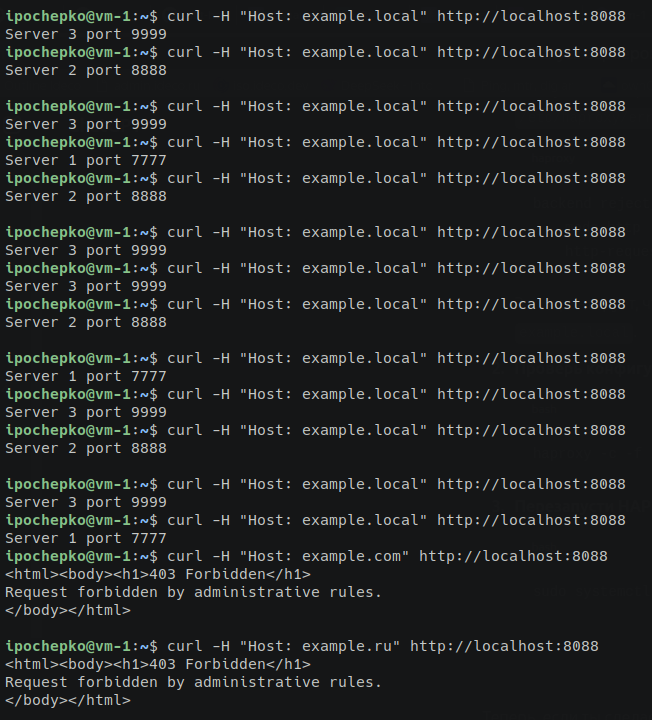

# Домашнее задание к занятию "`Кластеризация и балансировка нагрузки`" - `Почепко Илья`

### Задание 1

* Запустите два simple python сервера на своей виртуальной машине на разных портах
* Установите и настройте HAProxy, воспользуйтесь материалами к лекции по ссылке
* Настройте балансировку Round-robin на 4 уровне.
* На проверку направьте конфигурационный файл haproxy, скриншоты, где видно перенаправление запросов на разные серверы при обращении к HAProxy.

Файл haproxy.cfg: [haproxy.cfg](haproxy.cfg)

---

### Задание 2

* Запустите три simple python сервера на своей виртуальной машине на разных портах
* Настройте балансировку Weighted Round Robin на 7 уровне, чтобы первый сервер имел вес 2, второй - 3, а третий - 4
* HAproxy должен балансировать только тот http-трафик, который адресован домену example.local
* На проверку направьте конфигурационный файл haproxy, скриншоты, где видно перенаправление запросов на разные серверы при обращении к HAProxy c использованием домена example.local и без него.
 
Файл haproxy.cfg: [haproxy.cfg](haproxy-2.cfg)

---

### Задание 3*

* Настройте связку HAProxy + Nginx как было показано на лекции.
* Настройте Nginx так, чтобы файлы .jpg выдавались самим Nginx (предварительно разместите несколько тестовых картинок в директории /var/www/), а остальные запросы переадресовывались на HAProxy, который в свою очередь переадресовывал их на два Simple Python server.
* На проверку направьте конфигурационные файлы nginx, HAProxy, скриншоты с запросами jpg картинок и других файлов на Simple Python Server, демонстрирующие корректную настройку.

* [nginx](./nginx)
* [haproxy-3](haproxy-3.cfg)

